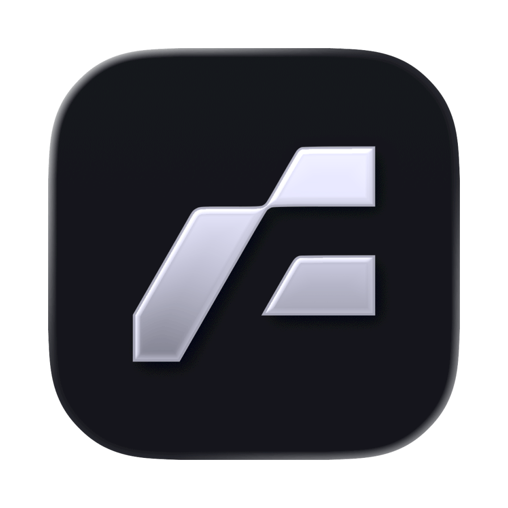
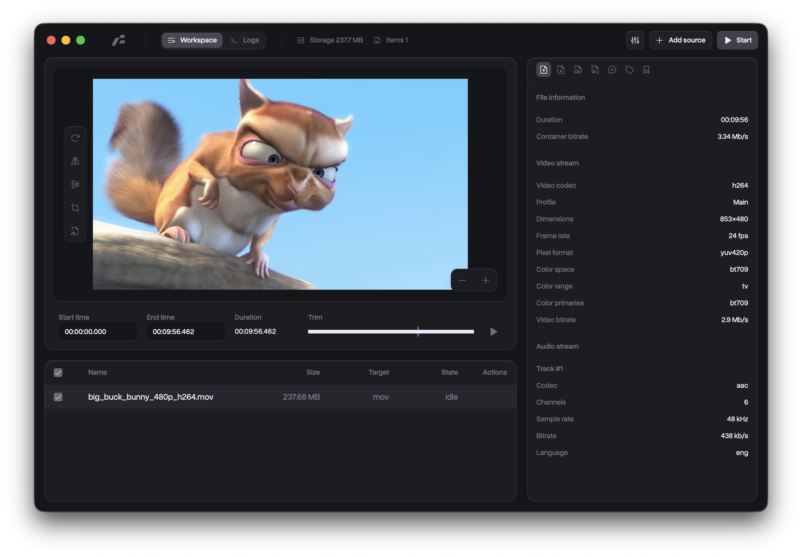

<div align="center">
  
  <h1>Frame</h1>
</div>

<div align="center">

[English](../README.md) | [简体中文](./zh-CN.md) | [日本語](./ja-JP.md) | [한국어](./ko-KR.md) | [Español](./es-ES.md) | [Русский](./ru-RU.md) | [Français](./fr-FR.md) | [Deutsch](./de-DE.md) | [Italiano](./it-IT.md)

</div>

<div align="center">
	
	
	
	
	
	
	<a href="https://github.com/sponsors/66HEX">
		
	</a>
</div>

**Frame** es una utilidad de conversión multimedia de alto rendimiento construida sobre el framework Tauri v2. Proporciona una interfaz nativa para las operaciones FFmpeg, permitiendo un control granular sobre los parámetros de conversión de vídeo, audio e imagen. La aplicación aprovecha un backend basado en Rust para la gestión de tareas concurrentes y la ejecución de procesos, junto con un frontend Svelte 5 para la configuración y monitorización del estado.

<br />
<div align="center">
  
</div>
<br />

> [!ADVERTENCIA]
> **Notificación de solicitud no firmada**
> Dado que la aplicación no está firmada, su sistema operativo la marcará:
>
> - **El sistema marcará la aplicación y sus binarios sidecar con un atributo de cuarentena. Para ejecutar la aplicación, elimine el atributo manualmente:
>   ```bash
>   xattr -dr com.apple.quarantine /Aplicaciones/Frame.app
>   ```
> - **Windows:** Windows SmartScreen puede impedir que se inicie la aplicación. Haga clic en **"Más información "** y luego en **"Ejecutar de todos modos "** para continuar.

## Patrocinadores de GitHub

Si Frame te ayuda, considera apoyar el proyecto en GitHub Sponsors:

[**Marco patrocinador**](https://github.com/sponsors/66HEX)

Objetivos de financiación actuales:

- **Programa para desarrolladores de Apple:** `99 $/año` para firmar y legalizar compilaciones de macOS.
- **Certificado de firma de código de Microsoft:** estimado en `300-$700/año` para firmar compilaciones de Windows y reducir la fricción de SmartScreen.

Las contribuciones de los patrocinadores se utilizan en primer lugar para sufragar estos gastos de liberación-firma.

Consulta [Patrocinadores de GitHub](https://github.com/sponsors/66HEX) para conocer todos los detalles del patrocinio, sugerencias de niveles y una lista de comprobación del lanzamiento.

## Características

### Núcleo de conversión multimedia

- **Tipos de medios:** Vídeo, audio, imagen.
- **Formatos de salida admitidos:**
  - **Vídeo:** `mp4`, `mkv`, `webm`, `mov`, `gif`
  - **Audio:** `mp3`, `m4a`, `wav`, `flac`
  - **Imagen:** `png`, `jpg`, `webp`, `bmp`, `tiff`
- **Codificadores de vídeo:**
  - `libx264` (H.264 / AVC)
  - `libx265` (H.265 / HEVC)
  - `vp9` (Google VP9)
  - `prores` (Apple ProRes)
  - `libsvtav1` (Tecnología de vídeo escalable AV1)
  - **Aceleración de hardware:** `h264_videotoolbox` (Apple Silicon), `hevc_videotoolbox` (Apple Silicon), `h264_nvenc` (NVIDIA), `hevc_nvenc` (NVIDIA), `av1_nvenc` (NVIDIA).
- **Codificadores de imagen:** `png`, `mjpeg` (JPEG), `libwebp` (WebP), `bmp`, `tiff`.
- **Codificadores de audio:** `aac`, `ac3` (Dolby Digital), `libopus`, `mp3`, `alac` (Apple Lossless), `flac` (Free Lossless Audio Codec), `pcm_s16le` (WAV).
- **Control de la tasa de bits:** Factor de tasa constante (CRF) o tasa de bits objetivo (kbps).
- **Escalado:** Bicúbico, Lanczos, Bilineal, Vecino más próximo.
- **Metadata Probing:** Extracción automatizada de detalles del flujo (códec, duración, bitrate, disposición de canales) mediante `ffprobe`.
- **Conversión ascendente IAI:** `Real-ESRGAN` integrado para vídeo de alta calidad y conversión ascendente de imágenes (x2, x4).

### Arquitectura y flujo de trabajo

- **Procesamiento concurrente:** Gestor de colas de tareas asíncronas implementado en Rust (`tokio::mpsc`) que limita los procesos concurrentes de FFmpeg (por defecto: 2).
- **Telemetría en tiempo real:** Análisis de flujo de FFmpeg `stderr` para un seguimiento preciso del progreso y salida de registro.
- **Gestión de preajustes:** Persistencia de la configuración para perfiles de conversión reutilizables.

## Pila técnica

### Backend (Rust / Tauri)

- **Core:** Tauri v2 (Rust Edition 2024).
- **Runtime:** `tokio` (Async I/O).
- **Serialización:** `serde`, `serde_json`.
- **Gestión de procesos:** `tauri-plugin-shell` para ejecución sidecar (FFmpeg/FFprobe).
- **Integración del sistema:** `tauri-plugin-dialog`, `tauri-plugin-fs`.

### Frontend (SvelteKit)

- **Framework:** Svelte 5 (API de Runas).
- **Sistema de construcción:** Vite.
- **Estilo:** Tailwind CSS v4, `clsx`, `tailwind-merge`.
- **Gestión de estados:** Svelte 5 `$state` / `$props`.
- **Internacionalización:** Interfaz multilingüe con detección automática del idioma del sistema.
- **Tipografía:** Loskeley Mono (incrustada).

## Instalación

### Descargar binarios precompilados

La forma más sencilla de empezar es descargar la última versión para su plataforma (macOS, Windows o Linux) directamente desde GitHub.

[Descarga de la última versión**](https://github.com/66HEX/frame/releases)

> **Nota:** Dado que la aplicación aún no está firmada por código, es posible que tenga que aprobarla manualmente en la configuración de su sistema (consulte la advertencia que aparece al principio de este archivo).

### WinGet (Windows)

Frame está disponible en el repositorio oficial de WinGet con el identificador `66HEX.Frame`.

```powershell
winget install --id 66HEX.Frame -e
```

Para actualizar:

```powershell
winget upgrade --id 66HEX.Frame -e
```

### Homebrew (macOS)

Los usuarios de macOS pueden instalar y actualizar Frame fácilmente utilizando nuestro Homebrew Tap personalizado:

```bash
brew tap 66HEX/frame
brew install --cask frame
```

### Requisitos del sistema Linux

Incluso cuando se utiliza **AppImage**, Frame depende de las librerías **WebKitGTK** y **GStreamer** del sistema para renderizar la interfaz de usuario y manejar la reproducción multimedia. Los diálogos nativos en Linux también requieren la integración de **XDG Desktop Portal** (además de un backend específico de escritorio) y `zenity` como fallback. Si la aplicación se bloquea al añadir una fuente, la previsualización de vídeo permanece en blanco, o los diálogos de archivo no se abren/tematizan correctamente, instala los paquetes que se indican a continuación.

- **Ubuntu / Debian:**

  ```bash
  sudo apt update
  sudo apt install libwebkit2gtk-4.1-0 gstreamer1.0-plugins-base gstreamer1.0-plugins-good gstreamer1.0-libav xdg-desktop-portal xdg-desktop-portal-gtk zenity
  ```

- **Arch Linux:**

  ```bash
  sudo pacman -S --needed webkit2gtk-4.1 gst-plugins-base gst-plugins-good gst-libav xdg-desktop-portal xdg-desktop-portal-gtk zenity
  ```

- **Fedora:**
  ```bash
  sudo dnf install webkit2gtk4.1 gstreamer1-plugins-base gstreamer1-plugins-good gstreamer1-libav xdg-desktop-portal xdg-desktop-portal-gtk zenity
  ```

> **Usuarios de KDE:** instalen `xdg-desktop-portal-kde` (en lugar de `xdg-desktop-portal-gtk`) para obtener diálogos temáticos nativos de Plasma.

### Construir desde la fuente

Si prefieres crear la aplicación tú mismo o quieres contribuir, sigue estos pasos.

**1. Requisitos previos**

- **Rust:** [Instalar Rust](https://www.rust-lang.org/tools/install)
- **Bun (o Node.js):** [Instalar Bun](https://bun.sh/)
- **Dependencias del sistema operativo:** Siga los [prerrequisitos de Tauri](https://v2.tauri.app/start/prerequisites/) para su sistema operativo.

**2. Configurar proyecto**

Clone el repositorio e instale las dependencias:

```bash
git clone https://github.com/66HEX/frame.git
cd frame
bun install
```

**3. Configurar binarios**

Frame necesita los binarios FFmpeg/FFprobe sidecar y los activos Real-ESRGAN sidecar para el escalado de IA. Proporcionamos secuencias de comandos para obtener automáticamente las versiones correctas para su plataforma:

```bash
bun run setup:ffmpeg
bun run setup:upscaler
```

**4. Construir o correr**

- **Desarrollo:**

  ```bash
  bun tauri dev
  ```

- **Construcción de producción:**
  ```bash
  bun tauri build
  ```

## Utilización

1.  **Entrada:** Utilice el diálogo del sistema para seleccionar los archivos.
2.  **Configuración:**
    - **Fuente:** Ver los metadatos del archivo detectado.
    - **Salida:** Seleccione el formato del contenedor y el nombre del archivo de salida.
    - **Vídeo:** Configura el códec, bitrate/CRF, resolución y velocidad de fotogramas.
    - **Imágenes:** Configure la resolución/escala de la imagen, el formato de píxel y la ampliación AI opcional.
    - **Audio:** Selecciona códec, bitrate, canales y pistas específicas.
    - **Presets:** Guarda y carga perfiles de conversión reutilizables.
3.  **Ejecución:** Inicia el proceso de conversión a través del backend Rust.
4.  **Supervisión:** Visualización de registros en tiempo real y contadores porcentuales en la interfaz de usuario.

## Historia de las estrellas

<picture>
  <source media="(prefers-color-scheme: dark)" srcset="https://api.star-history.com/svg?repos=66HEX/frame&type=timeline&theme=dark" />
  <source media="(prefers-color-scheme: light)" srcset="https://api.star-history.com/svg?repos=66HEX/frame&type=timeline" />
  
</picture>

## Agradecimientos y código de terceros

- **Real-ESRGAN**: Copyright (c) 2021, Xintao Wang. Licencia bajo [BSD 3-Clause](https://github.com/xinntao/Real-ESRGAN/blob/master/LICENSE).
- **FFmpeg**: Licencia bajo [GPLv3](https://www.ffmpeg.org/legal.html).

## Licencia

Licencia GPLv3. Véase [LICENSE](../LICENSE) para más detalles.
